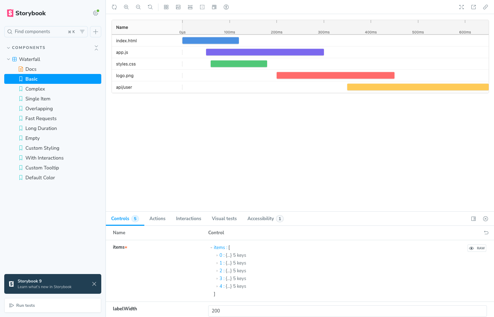
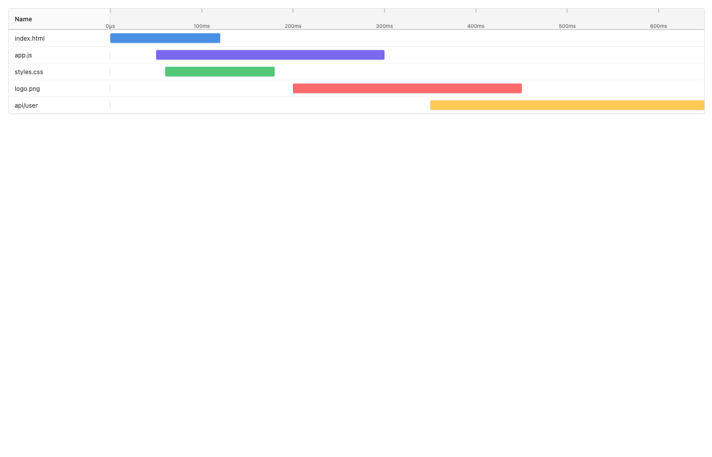
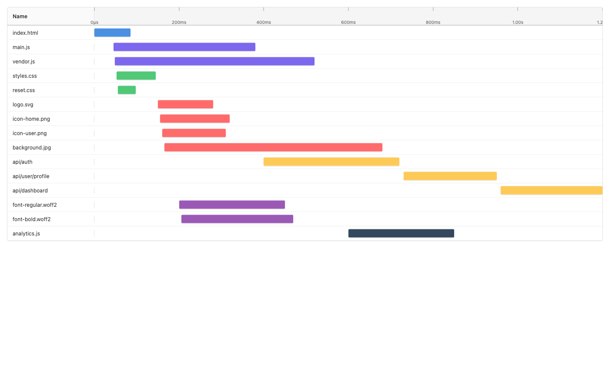
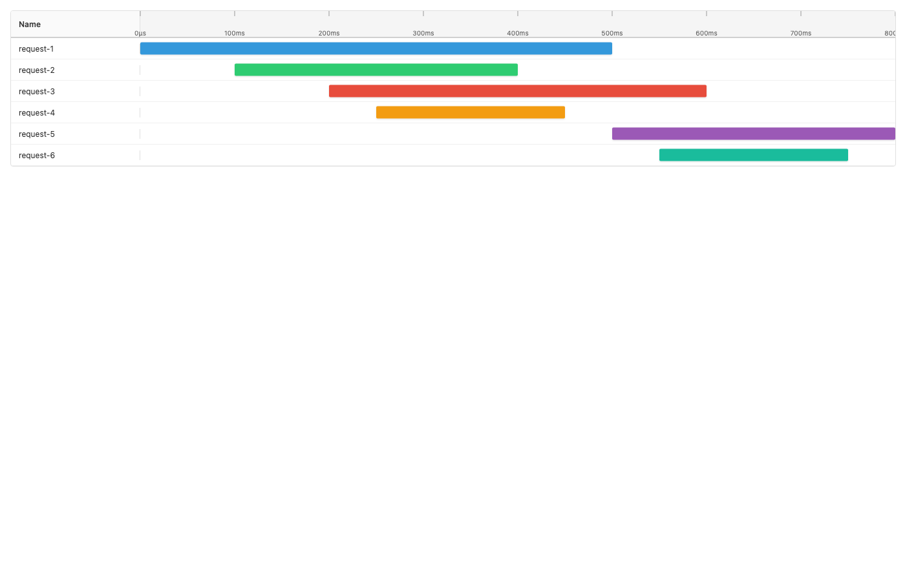
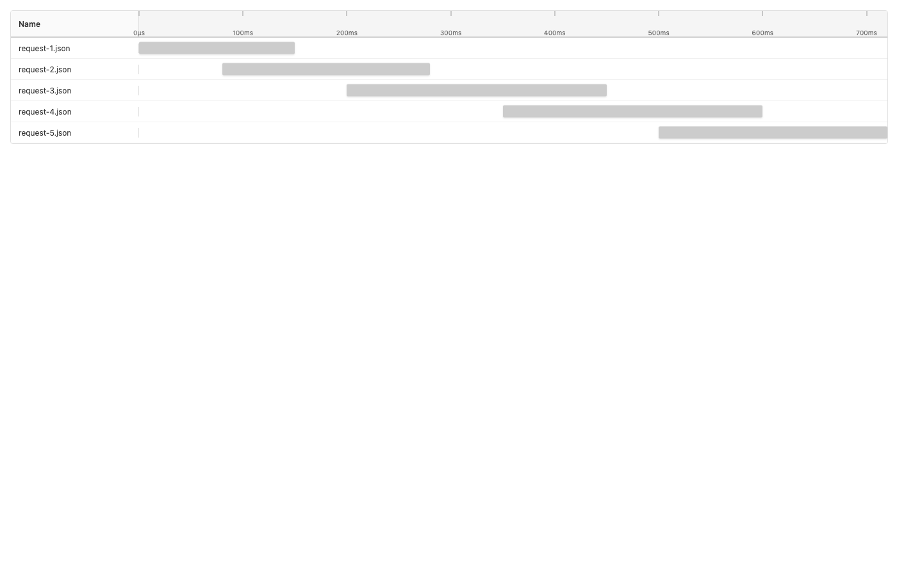

# React Waterfall Timeline

<div align="center">

A waterfall timeline component similar to Chrome DevTools Network panel for visualizing time-related data.



[](https://www.npmjs.com/package/react-waterfall-timeline)
[](https://opensource.org/licenses/MIT)

<!-- [Live Demo](https://your-storybook-url.com) · [Report Bug](https://github.com/yourusername/react-waterfall-timeline/issues) · [Request Feature](https://github.com/yourusername/react-waterfall-timeline/issues) -->

</div>

---

## ✨ Features

- 🎯 **Intuitive Timeline Display**: Visual effects similar to Chrome DevTools Network panel
- 📊 **Smart Time Scale**: Automatically generates reasonable time scale rulers based on data range
- 📍 **Time Indicator Line**: Shows vertical indicator line and current time position on hover
- 🎨 **Customizable Styles**: Supports custom colors, sizes, and other properties
- 🖱️ **Interactive Experience**: Supports click and hover events with detailed tooltip information
- 🎯 **Smart Tooltip Positioning**: Tooltips intelligently measure themselves and adjust position based on actual DOM size to avoid viewport overflow
- 📱 **Responsive Design**: Adapts to different screen sizes
- ⚡ **High Performance**: Optimized rendering performance using React.memo
- 🔧 **TypeScript Support**: Complete type definitions
- ⏳ **Flexible Time States**: Supports items without start time (not started) and items without end time (in progress, shown as dashed lines)

## 📦 Installation

```bash
npm install react-waterfall-timeline
# or
yarn add react-waterfall-timeline
# or
pnpm add react-waterfall-timeline
```

## 🚀 Quick Start

```tsx
import { Waterfall } from 'react-waterfall-timeline';
import 'react-waterfall-timeline/style.css';

function App() {
  const items = [
    {
      id: '1',
      name: 'index.html',
      startTime: 0,
      endTime: 120,
      color: '#4a90e2',
    },
    { id: '2', name: 'app.js', startTime: 50, endTime: 300, color: '#7b68ee' },
    {
      id: '3',
      name: 'api/data',
      startTime: 200,
      endTime: 450,
      color: '#feca57',
    },
  ];

  return <Waterfall items={items} />;
}
```

## 📸 Examples

### Basic Timeline

Simple example with a few network requests.



```tsx
import { Waterfall } from 'react-waterfall-timeline';
import 'react-waterfall-timeline/style.css';

const basicItems = [
  {
    id: '1',
    name: 'index.html',
    startTime: 0,
    endTime: 120,
    color: '#4a90e2',
  },
  {
    id: '2',
    name: 'app.js',
    startTime: 50,
    endTime: 300,
    color: '#7b68ee',
  },
  {
    id: '3',
    name: 'styles.css',
    startTime: 60,
    endTime: 180,
    color: '#50c878',
  },
  {
    id: '4',
    name: 'logo.png',
    startTime: 200,
    endTime: 450,
    color: '#ff6b6b',
  },
  {
    id: '5',
    name: 'api/user',
    startTime: 350,
    endTime: 650,
    color: '#feca57',
  },
];

function App() {
  return <Waterfall items={basicItems} />;
}
```

### Complex Timeline

More complex scenario with many overlapping requests of different types.



```tsx
import { Waterfall } from 'react-waterfall-timeline';
import 'react-waterfall-timeline/style.css';

const complexItems = [
  { id: '1', name: 'index.html', startTime: 0, endTime: 85, color: '#4a90e2' },
  { id: '2', name: 'main.js', startTime: 45, endTime: 380, color: '#7b68ee' },
  { id: '3', name: 'vendor.js', startTime: 48, endTime: 520, color: '#7b68ee' },
  {
    id: '4',
    name: 'styles.css',
    startTime: 52,
    endTime: 145,
    color: '#50c878',
  },
  { id: '5', name: 'reset.css', startTime: 55, endTime: 98, color: '#50c878' },
  { id: '6', name: 'logo.svg', startTime: 150, endTime: 280, color: '#ff6b6b' },
  {
    id: '7',
    name: 'icon-home.png',
    startTime: 155,
    endTime: 320,
    color: '#ff6b6b',
  },
  {
    id: '8',
    name: 'icon-user.png',
    startTime: 160,
    endTime: 310,
    color: '#ff6b6b',
  },
  {
    id: '9',
    name: 'background.jpg',
    startTime: 165,
    endTime: 680,
    color: '#ff6b6b',
  },
  {
    id: '10',
    name: 'api/auth',
    startTime: 400,
    endTime: 720,
    color: '#feca57',
  },
  {
    id: '11',
    name: 'api/user/profile',
    startTime: 730,
    endTime: 950,
    color: '#feca57',
  },
  {
    id: '12',
    name: 'api/dashboard',
    startTime: 960,
    endTime: 1200,
    color: '#feca57',
  },
  {
    id: '13',
    name: 'font-regular.woff2',
    startTime: 200,
    endTime: 450,
    color: '#9b59b6',
  },
  {
    id: '14',
    name: 'font-bold.woff2',
    startTime: 205,
    endTime: 470,
    color: '#9b59b6',
  },
  {
    id: '15',
    name: 'analytics.js',
    startTime: 600,
    endTime: 850,
    color: '#34495e',
  },
];

function App() {
  return <Waterfall items={complexItems} />;
}
```

### Overlapping Requests

Common scenario with multiple overlapping requests running in parallel.



```tsx
import { Waterfall } from 'react-waterfall-timeline';
import 'react-waterfall-timeline/style.css';

const overlappingItems = [
  { id: '1', name: 'request-1', startTime: 0, endTime: 500, color: '#3498db' },
  {
    id: '2',
    name: 'request-2',
    startTime: 100,
    endTime: 400,
    color: '#2ecc71',
  },
  {
    id: '3',
    name: 'request-3',
    startTime: 200,
    endTime: 600,
    color: '#e74c3c',
  },
  {
    id: '4',
    name: 'request-4',
    startTime: 250,
    endTime: 450,
    color: '#f39c12',
  },
  {
    id: '5',
    name: 'request-5',
    startTime: 500,
    endTime: 800,
    color: '#9b59b6',
  },
  {
    id: '6',
    name: 'request-6',
    startTime: 550,
    endTime: 750,
    color: '#1abc9c',
  },
];

function App() {
  return <Waterfall items={overlappingItems} />;
}
```

### Default Color (Gray)

Items without a custom color will use the default gray color.



```tsx
import { Waterfall } from 'react-waterfall-timeline';
import 'react-waterfall-timeline/style.css';

const itemsWithoutColor = [
  {
    id: '1',
    name: 'request-1.json',
    startTime: 0,
    endTime: 150,
  },
  {
    id: '2',
    name: 'request-2.json',
    startTime: 80,
    endTime: 280,
  },
  {
    id: '3',
    name: 'request-3.json',
    startTime: 200,
    endTime: 450,
  },
  {
    id: '4',
    name: 'request-4.json',
    startTime: 350,
    endTime: 600,
  },
  {
    id: '5',
    name: 'request-5.json',
    startTime: 500,
    endTime: 720,
  },
];

function App() {
  return <Waterfall items={itemsWithoutColor} />;
}
```

### In-Progress Tasks

Items with only `startTime` (no `endTime`) will be displayed with a gradient fade effect (left to right), representing tasks that are currently in progress.

```tsx
import { Waterfall } from 'react-waterfall-timeline';
import 'react-waterfall-timeline/style.css';

const inProgressItems = [
  {
    id: '1',
    name: 'completed-task',
    startTime: 0,
    endTime: 300,
    color: '#2ecc71',
  },
  {
    id: '2',
    name: 'in-progress-1',
    startTime: 250,
    // No endTime - shown with gradient fade effect
    color: '#f39c12',
  },
  {
    id: '3',
    name: 'in-progress-2',
    startTime: 400,
    // No endTime - shown with gradient fade effect
    color: '#e74c3c',
  },
];

function App() {
  return <Waterfall items={inProgressItems} />;
}
```

### Mixed States

A realistic scenario combining not-started items (no `startTime`), completed items (both times), and in-progress items (no `endTime`).

```tsx
import { Waterfall } from 'react-waterfall-timeline';
import 'react-waterfall-timeline/style.css';

const mixedItems = [
  {
    id: '1',
    name: 'not-started-yet',
    // No startTime - only shows label
    color: '#95a5a6',
  },
  {
    id: '2',
    name: 'completed-task',
    startTime: 0,
    endTime: 150,
    color: '#2ecc71',
  },
  {
    id: '3',
    name: 'in-progress-task',
    startTime: 160,
    // No endTime - shown with gradient fade effect
    color: '#f39c12',
  },
  {
    id: '4',
    name: 'another-not-started',
    // No startTime - only shows label
    color: '#95a5a6',
  },
];

function App() {
  return <Waterfall items={mixedItems} />;
}
```

## 📚 API Documentation

### `<Waterfall>` Props

| Property        | Type                                    | Default      | Description                               |
| --------------- | --------------------------------------- | ------------ | ----------------------------------------- |
| `items`         | `WaterfallItem[]`                       | **Required** | Array of timeline data to display         |
| `labelWidth`    | `number`                                | `200`        | Width of the left label column (pixels)   |
| `rowHeight`     | `number`                                | `32`         | Height of each row (pixels)               |
| `rulerHeight`   | `number`                                | `40`         | Height of the ruler (pixels)              |
| `onItemClick`   | `(item: WaterfallItem) => void`         | `undefined`  | Callback function when an item is clicked |
| `onItemHover`   | `(item: WaterfallItem \| null) => void` | `undefined`  | Callback function when an item is hovered |
| `renderTooltip` | `RenderTooltipCallback`                 | `undefined`  | Custom tooltip render function            |
| `className`     | `string`                                | `''`         | Custom CSS class name                     |

### `WaterfallItem` Interface

```typescript
interface WaterfallItem {
  /** Unique identifier for the item */
  id: string;

  /** Display name shown on the left side */
  name: string;

  /** Start time in milliseconds (optional - if not provided, item won't show on timeline) */
  startTime?: number;

  /** End time in milliseconds (optional - if not provided, will show as dashed line) */
  endTime?: number;

  /** Optional color for the timeline bar (default: #cccccc) */
  color?: string;
}
```

**Time States:**

- **Both startTime and endTime**: Shows a solid bar representing a completed task
- **Only startTime (no endTime)**: Shows a gradient fade effect (left to right) extending to the end, representing an in-progress task
- **No startTime**: Only shows the name label on the left, useful for items that haven't started yet

### Type Definitions

```typescript
type OnItemClickCallback = (item: WaterfallItem) => void;
type OnItemHoverCallback = (item: WaterfallItem | null) => void;
type RenderTooltipCallback = (
  item: WaterfallItem,
  position: { x: number; y: number }
) => React.ReactNode;
```

## 🤝 Contributing

Contributions are welcome! Please feel free to submit a Pull Request.

1. Fork the repository
2. Create your feature branch (`git checkout -b feature/amazing-feature`)
3. Commit your changes (`git commit -m 'Add some amazing feature'`)
4. Push to the branch (`git push origin feature/amazing-feature`)
5. Open a Pull Request

## 📄 License

This project is licensed under the MIT License - see the [LICENSE](LICENSE) file for details.

## 🙏 Acknowledgments

- Inspired by Chrome DevTools Network panel
- Built with modern React best practices
- Designed for performance and flexibility

## 📮 Contact

- **Issues**: [GitHub Issues](https://github.com/moonrailgun/react-waterfall-timeline/issues)

---

<div align="center">

Made with ❤️ by [moonrailgun](https://github.com/moonrailgun)

If you find this project useful, please consider giving it a ⭐️!

</div>
